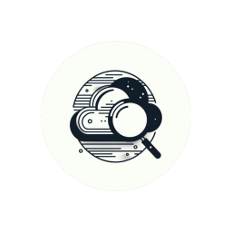

# cloud-detect


[](https://crates.io/crates/cloud-detect)
[](https://www.gnu.org/licenses/gpl-3.0)



Rust library that detects a host's cloud service provider.

This library is heavily inspired by the Python [cloud-detect](https://github.com/dgzlopes/cloud-detect)
module, and replicates most of its functionality (even most of the code is structured similarly).

## Features

* Supports the identification of the following providers:
    - Amazon Web Services (`aws`)
    - Microsoft Azure (`azure`)
    - Google Cloud Platform (`gcp`)
    - Alibaba Cloud (`alibaba`)
    - OpenStack (`openstack`)
* Fast, simple and extensible.

## Usage

First, add the library to your project by adding the following to your `Cargo.toml` file:

```toml
[dependencies]
cloud-detect = "0.5.0"
tokio = { version = "1.29.1", features = ["full"] }
```

Next, you can detect the current host's cloud provider as follows:

```rust
use cloud_detect::detect;

#[tokio::main]
async fn main() {
    let provider = detect().await;

    // When tested on AWS:
    println!("{}", provider); // "aws"

    // When tested on local/non-supported cloud environment:
    println!("{}", provider); // "unknown"
}
```

You can also check the list of currently supported cloud providers.

```rust
use cloud_detect::SUPPORTED_PROVIDERS;

#[tokio::main]
async fn main() {
    println("{}", SUPPORTED_PROVIDERS.join(", "));
}
```

**NOTE**: Currently, only asynchronous detection is supported. Blocking detection *may* be added to a future release.

## Contributing

TODO